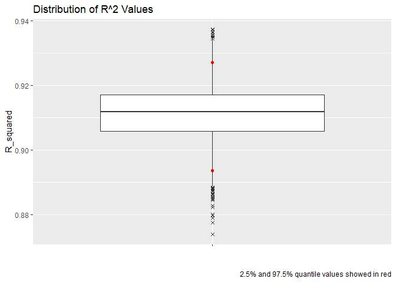
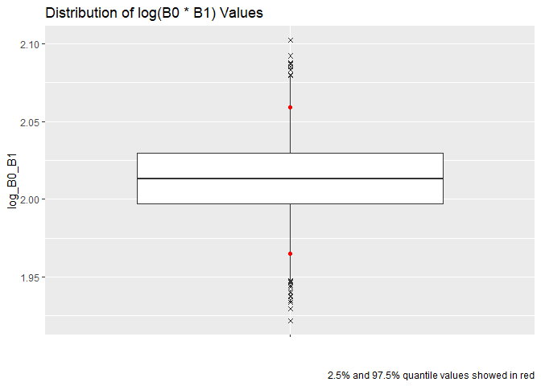
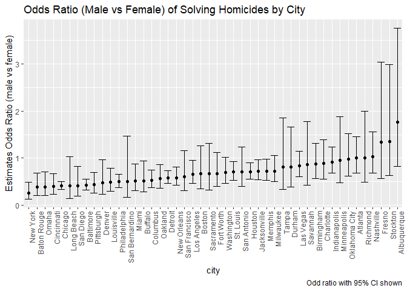
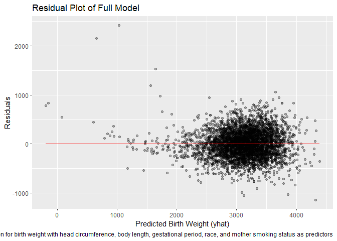
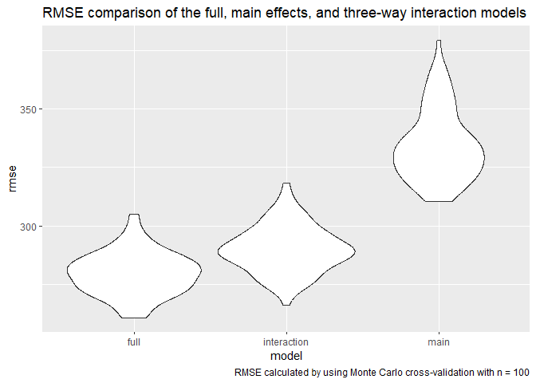

HW6
================
Adeena Moghni
2024-11-24

## Problem 1

``` r
weather_df = 
  rnoaa::meteo_pull_monitors(
    c("USW00094728"),
    var = c("PRCP", "TMIN", "TMAX"), 
    date_min = "2017-01-01",
    date_max = "2017-12-31") %>%
  mutate(
    name = recode(id, USW00094728 = "CentralPark_NY"),
    tmin = tmin / 10,
    tmax = tmax / 10) %>%
  select(name, id, everything())
```

    ## using cached file: C:\Users\adeen\AppData\Local/R/cache/R/rnoaa/noaa_ghcnd/USW00094728.dly

    ## date created (size, mb): 2024-09-26 10:18:38.832335 (8.668)

    ## file min/max dates: 1869-01-01 / 2024-09-30

``` r
boot_function = function(df) {
  bootstrap = sample_frac(df, replace = TRUE)
  
  model = lm(tmax ~ tmin, data = bootstrap)
  
  R_squared = 
    model %>% 
    broom::glance() %>% 
    pull(r.squared)
  
  coeff = 
    model %>% 
    broom::tidy() %>% 
    pull(estimate)
  
    log_B0_B1 = log(coeff[1] * coeff[2])
  
  tibble(R_squared = R_squared, log_B0_B1 = log_B0_B1)
}
```

``` r
bootstrap_df = 
  tibble(strap_number = 1:5000) %>% 
  mutate(
    strap_sample = map(strap_number, \(i) boot_function(df = weather_df))
  ) %>% 
  unnest(strap_sample)
```

``` r
R2_quantile = 
  bootstrap_df %>% 
  summarize(
    lower_ci = quantile(R_squared, .025),
    higher_ci = quantile(R_squared, .975)
  )

log_quantile = 
  bootstrap_df %>% 
  summarize(
    lower_ci = quantile(log_B0_B1, .025),
    higher_ci = quantile(log_B0_B1, .975)
  )
```

``` r
ggplot(bootstrap_df, aes(x = "", y = R_squared)) +
  geom_boxplot(outlier.shape = 4) +
  geom_point(data = R2_quantile, aes(x = "", y = lower_ci), color = "red") +
  geom_point(data = R2_quantile, aes(x = "", y = higher_ci), color = "red") +
  labs(
    x = "",
    title = "Distribution of R^2 Values",
    caption  = "2.5% and 97.5% quantile values showed in red"
  )
```

<!-- -->

``` r
  ggplot(bootstrap_df, aes(x = "", y = log_B0_B1)) +
  geom_boxplot(outlier.shape = 4) +
  geom_point(data = log_quantile, aes(x = "", y = lower_ci), color = "red") +
  geom_point(data = log_quantile, aes(x = "", y = higher_ci), color = "red") +
  labs(
    x = "",
    title = "Distribution of log(B0 * B1) Values",
    caption  = "2.5% and 97.5% quantile values showed in red"
  )
```

<!-- -->

## Problem 2

``` r
homicide_df = 
  read_csv(file = "./homicide-data.csv", na = c("NA", ".", "", "Unknown")) %>%
  janitor::clean_names() %>% 
  distinct() %>% 
  mutate(
    city_state = paste(city, ",", state),
    status = ifelse(disposition %in% c("Closed without arrest", "Open/No arrest"), 
                    "0", "1"),
    status = as.numeric(status),
    victim_age = as.numeric(victim_age)) %>% 
  filter(!city %in% c("Dallas", "Phoenix", "Kansas City", "Tulsa"),
         victim_race %in% c("Black", "White"))
```

    ## Rows: 52179 Columns: 12
    ## ── Column specification ────────────────────────────────────────────────────────
    ## Delimiter: ","
    ## chr (8): uid, victim_last, victim_first, victim_race, victim_sex, city, stat...
    ## dbl (4): reported_date, victim_age, lat, lon
    ## 
    ## ℹ Use `spec()` to retrieve the full column specification for this data.
    ## ℹ Specify the column types or set `show_col_types = FALSE` to quiet this message.

``` r
baltimore_df = 
  homicide_df %>% 
  filter(city == "Baltimore")

model = glm(status ~ victim_age + victim_sex + victim_race, 
            family = binomial(link = "logit"), 
            data = baltimore_df) %>% 
  broom::tidy(conf.int = TRUE) %>% 
  mutate(
    odds_ratio = exp(estimate),
    lower_ci = exp(conf.low), 
    upper_ci = exp(conf.high),
    ) %>% 
  select(term, estimate, odds_ratio, lower_ci, upper_ci) %>% 
  filter(term == "victim_sexMale")
```

``` r
city_df = 
  homicide_df %>% 
  nest(data = -city) %>% 
  mutate(
    model = map(data, 
              \(df) glm(status ~ victim_age + victim_sex + victim_race, 
            family = binomial(link = "logit"), 
            data = df)),
    results = map(model, ~broom::tidy(.x, conf.int = TRUE))
    ) %>% 
  unnest(results) %>% 
  mutate(
    odds_ratio = exp(estimate),
    lower_ci = exp(conf.low), 
    upper_ci = exp(conf.high),
    ) %>% 
  select(city, term, estimate, odds_ratio, lower_ci, upper_ci) %>% 
  filter(term == "victim_sexMale") %>% 
  mutate(city = fct_reorder(city, odds_ratio))
```

``` r
ggplot(city_df, aes(x = city, y = odds_ratio)) +
  geom_point() + 
  geom_errorbar(aes(ymin = lower_ci, ymax = upper_ci)) +
  theme(axis.text.x = element_text(angle = 90, hjust = 1)) +
  labs(x = "city", 
       y = "Estimates Odds Ratio (male vs female)",
       title = "Odds Ratio (Male vs Female) of Solving Homicides by City"
       )
```

<!-- -->

## Problem 3

``` r
birth_df = 
  read_csv(file = "./birthweight.csv", na = c("NA", ".", "", "Unknown")) %>% 
  janitor::clean_names() %>% 
  drop_na()%>% 
  mutate(
    babysex = as.factor(babysex),
    frace = as.factor(frace),
    mrace = as.factor(mrace),
    maform = as.factor(malform)
  )
```

    ## Rows: 4342 Columns: 20
    ## ── Column specification ────────────────────────────────────────────────────────
    ## Delimiter: ","
    ## dbl (20): babysex, bhead, blength, bwt, delwt, fincome, frace, gaweeks, malf...
    ## 
    ## ℹ Use `spec()` to retrieve the full column specification for this data.
    ## ℹ Specify the column types or set `show_col_types = FALSE` to quiet this message.

``` r
full_model = lm(bwt ~ bhead + blength + gaweeks + mrace + smoken, data = birth_df)

main_model = lm(bwt ~ blength + gaweeks, data = birth_df) 

interaction_model =lm(bwt ~ bhead * blength * babysex, data = birth_df)
```

``` r
birth_plot_df = 
  birth_df %>% 
  add_residuals(full_model, var = "residuals") %>% 
  add_predictions(full_model, var = "yhat")
  
ggplot(birth_plot_df, aes(x = yhat, y = residuals)) +
  geom_point(alpha = .3) +
  geom_line(aes(y = 0), color = "red") +
  labs(
    x = "Predicted Birth Weight (yhat)",
    y = "Residuals",
    title = "Residual Plot of Full Model",
    caption = "Full model using lm() regression for birth weight with head circumference, body length, gestational period, race, and mother smoking status as predictors"
  )
```

<!-- -->

``` r
cv_df = 
  crossv_mc(birth_df, 100) %>% 
   mutate(
    train = map(train, as_tibble),
    test = map(test, as_tibble)) %>% 
  mutate( 
    full_model = map(train, ~lm(bwt ~ bhead + blength + gaweeks + mrace + smoken, data = .x)), 
    main_model = map(train, ~lm(bwt ~ blength + gaweeks, data = .x)), 
    interaction_model = map(train, ~lm(bwt ~ bhead * blength * babysex, data = .x)))%>% 
  mutate(
      rmse_full = map2_dbl(full_model, test, ~rmse(model = .x, data = .y)),
    rmse_main = map2_dbl(main_model, test, ~rmse(model = .x, data = .y)),
    rmse_interaction = map2_dbl(interaction_model, test, ~rmse(model = .x, data = .y)))
```

``` r
plot_df = 
  cv_df %>% 
  select(starts_with("rmse")) %>% 
  pivot_longer(
    everything(),
    names_to = "model", 
    values_to = "rmse",
    names_prefix = "rmse_") 
   
ggplot(plot_df, aes(x = model, y = rmse)) + 
  geom_violin() + 
  labs(
    title = "RMSE comparison of the full, main effects, and three-way interaction models",
    caption = "RMSE calculated by using Monte Carlo cross-validation with n = 100"
  )
```

<!-- -->
